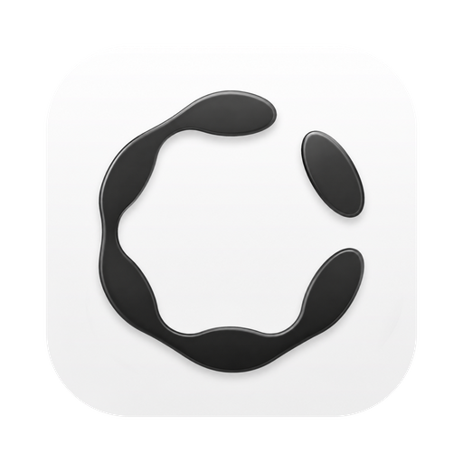
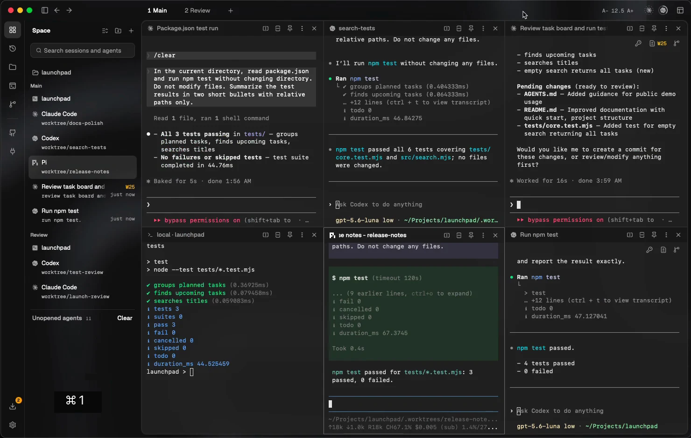
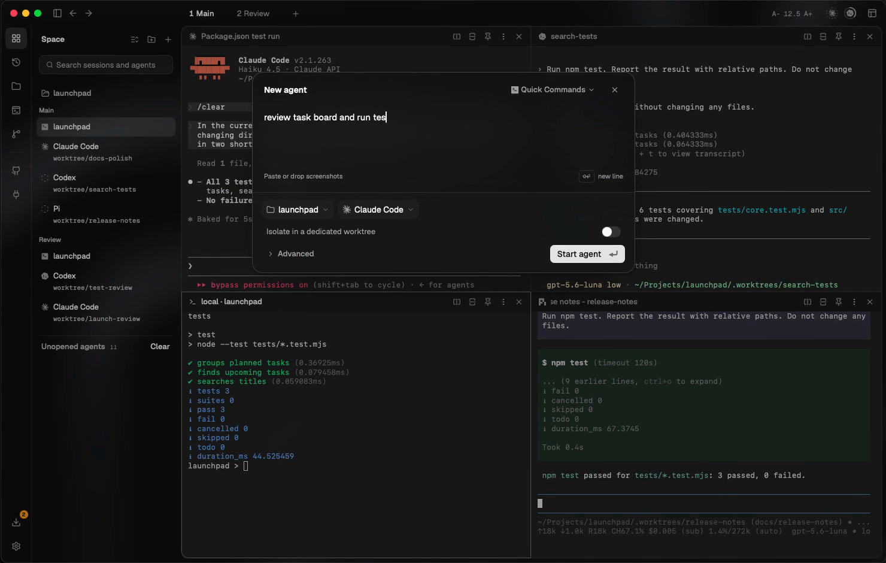
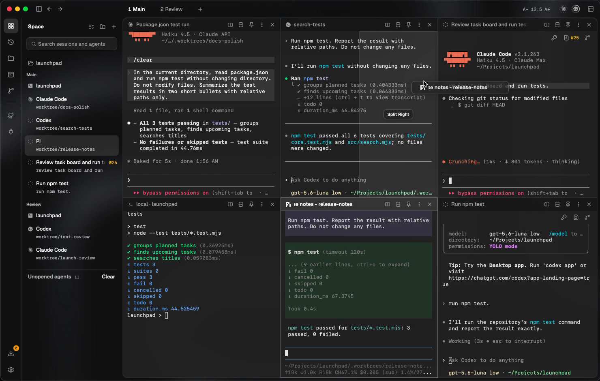

<div align="center">

<a href="https://www.dureai.dev/">
  
</a>

# Dure

### You lead.<br>Your agents work together.

An **Agent Development Environment (ADE)** for your AI coding agents.<br>
Projects, conversations, terminals and code changes — together in one macOS workspace.

**[Download for macOS](https://www.dureai.dev/download/mac/)** &nbsp;·&nbsp; [Website](https://www.dureai.dev/) &nbsp;·&nbsp; [Documentation](https://docs.dureai.dev/en/introduction) &nbsp;·&nbsp; [X](https://x.com/hebbianai_) &nbsp;·&nbsp; [Discord](https://discord.gg/aTuRV6DXhb)

<sub>Apple Silicon · Bring your own coding-agent CLIs and accounts</sub>

**English** · [한국어](docs/readme/README.ko.md) · [简体中文](docs/readme/README.zh.md) · [日本語](docs/readme/README.ja.md) · [Español](docs/readme/README.es.md) · [Français](docs/readme/README.fr.md) · [Português](docs/readme/README.pt.md)

<br>

<a href="https://www.dureai.dev/#hero-film">
  
</a>

**[▶ Watch Dure in 29 seconds](https://www.dureai.dev/#hero-film)** · [Download MP4](https://raw.githubusercontent.com/hebbianai/dure/main/public/readme/workspace-tour.mp4)

<sub>Native app footage with live coding-agent CLIs in a sample project.<br>The GitHub issue list uses demo data. Recorded on a development build; the downloaded version may differ.</sub>

</div>

## More agents. One place to lead.

The hard part isn't starting another agent. It's knowing which task needs you, what changed, and what to do next.

Dure brings that work into one place. Keep Claude Code beside Codex and Pi. Follow sessions across projects and SSH hosts. Read the diff, send feedback, and give the next task a clear direction.

## From the first task to the final review

### 01 — Start with a goal

Press **⌘N**, describe the task, and choose a project and provider. Give independent editing tasks their own Git worktree and branch. Or choose **Start** on a GitHub issue to open a prefilled task.

### 02 — Arrange your attention

Split panes, move tabs, switch desktops, or open a session in its own window. Spaces keeps local and SSH work visible together, with activity and change indicators to help you find what needs attention.

<table>
<tr>
<td width="50%">
<a href="https://docs.dureai.dev/en/quickstart"></a>
<br><sub>Describe the work. Choose the agent.</sub>
</td>
<td width="50%">
<a href="https://docs.dureai.dev/en/spaces-and-panes"></a>
<br><sub>Move the view. Keep the working context.</sub>
</td>
</tr>
</table>

### 03 — Review and steer

Inspect local changes, including uncommitted and new files. Add line comments and send them back to the agent. Check the changes and test results before combining the work — you decide what happens next.

[Your first agent →](https://docs.dureai.dev/en/quickstart) &nbsp; [Parallel tasks →](https://docs.dureai.dev/en/first-parallel-workflow) &nbsp; [Review and feedback →](https://docs.dureai.dev/en/review-and-feedback)

## The workspace around your agents

| When you need to… | Dure brings… |
| --- | --- |
| Work on independent tasks | Dedicated Git worktrees and branches, with the task's files kept separate. |
| Keep track of running work | Spaces, split panes, desktops and detached windows across projects. |
| Return after closing the app | Reattachment to live managed sessions; a separate recovery flow for ended processes. |
| Work across machines | SSH projects and remote terminals alongside local work, with image paste and file transfer. |
| Use your existing accounts | Per-agent profiles and provider-reported usage where supported. |
| Connect repeatable work | CLI runs and schedules; CLI/MCP messages, decision requests and completion reports. |
| Make the workspace yours | Themes, terminal typography and an interface available in seven languages. |

### Your tools. Your accounts.

Use native coding-agent CLIs such as **Claude Code, Codex, Pi, Gemini CLI, OpenCode and Kimi Code**. Dure is a workspace, not a model or a provider subscription. Provider subscriptions and usage charges remain separate.

Terminal support, conversation history, chat views and account tools vary by provider. [Check provider capabilities →](https://docs.dureai.dev/en/providers)

## Start on your Mac

1. **[Download Dure for macOS](https://www.dureai.dev/download/mac/)** on an Apple Silicon Mac. Open the disk image and move the app to **Applications**.
2. Install and sign in to at least one supported coding-agent CLI. Follow the [installation guide](https://docs.dureai.dev/en/install), including its macOS security guidance.
3. Open a familiar Git project in Dure. Press **⌘N** and start with one small task.

Try this first:

```text
Find out how to run this repository's tests.
Do not modify any files.
Tell me the commands and which files document them.
```

### A few boundaries worth knowing

- **Worktrees separate files, not permissions.** They are not security sandboxes; credentials, processes and network access are not isolated by a worktree. Changes can still conflict when combined.
- **A running host matters.** Managed sessions can outlive the app window while the host process and machine remain running. A reboot ends the original process; recovery creates a replacement.
- **Review still matters.** Check agent permissions, changes and verification results before accepting work. Account switching and remote-session behavior have provider and runtime limits.

[Sessions and recovery](https://docs.dureai.dev/en/session-model) · [SSH](https://docs.dureai.dev/en/remote-and-ssh) · [Work-safety guidance](https://docs.dureai.dev/en/current-limits)

## Source availability

**License: [MIT](LICENSE) · Copyright (c) 2026 Hebbian AI.**

Dure's first-party source is available in this repository under MIT. Third-party components retain their own licenses and copyright notices.

Build from source using the [contribution guide](CONTRIBUTING.md#source-and-development). App downloads are available from the [website](https://www.dureai.dev/download/mac/).

## Contributing

Read the [contribution guide](CONTRIBUTING.md), follow our [Code of Conduct](CODE_OF_CONDUCT.md), or [report a bug or propose a feature](https://github.com/hebbianai/dure/issues/new/choose). For vulnerabilities, use the private channel in our [security policy](SECURITY.md).

---

<div align="center">

**You lead. Your agents work together.**

[Download Dure](https://www.dureai.dev/download/mac/) · [Read the docs](https://docs.dureai.dev/en/introduction) · [dureai.dev](https://www.dureai.dev/) · [X](https://x.com/hebbianai_) · [Discord](https://discord.gg/aTuRV6DXhb)

</div>
