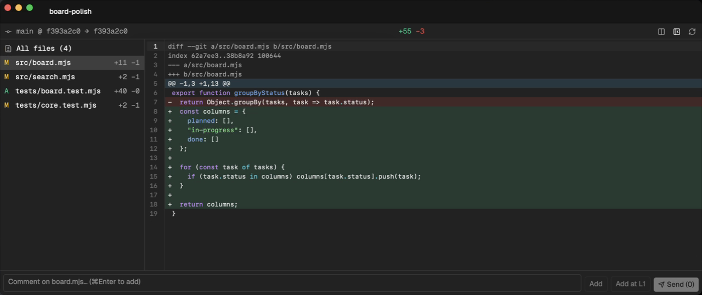

<div align="center">

<a href="https://www.dureai.dev/">
  
</a>

# Dure

### Você lidera.<br>Seus agentes trabalham juntos.

Um **espaço de trabalho de código aberto para agentes de programação com IA**.<br>
Coordene Claude Code, Codex e Pi entre projetos e hosts SSH, com worktrees dedicadas e revisão de código integrada.

**[Baixar para macOS](https://www.dureai.dev/download/mac/)** &nbsp;·&nbsp; [Site](https://www.dureai.dev/) &nbsp;·&nbsp; [Documentação (inglês)](https://docs.dureai.dev/en/introduction) &nbsp;·&nbsp; [X](https://x.com/hebbianai_) &nbsp;·&nbsp; [Discord](https://discord.gg/aTuRV6DXhb)

<sub>Apple Silicon · Use suas CLIs de agentes de programação e suas contas de sempre</sub>

[English](../../README.md) · [한국어](README.ko.md) · [简体中文](README.zh.md) · [日本語](README.ja.md) · [Español](README.es.md) · [Français](README.fr.md) · **Português**

<br>

<a href="https://www.dureai.dev/#hero-film">
  
</a>

**[▶ Conheça o Dure em 29 segundos](https://www.dureai.dev/#hero-film)** · [Baixar MP4](https://raw.githubusercontent.com/hebbianai/dure/main/public/readme/workspace-tour.mp4)

<sub>Gravação do aplicativo nativo com CLIs de agentes reais em um projeto de exemplo.<br>A lista de issues do GitHub usa dados de demonstração. A gravação foi feita em uma versão de desenvolvimento; a versão baixada pode ser diferente.</sub>

</div>

<sub>Os links de documentação desta tradução levam à versão em inglês.</sub>

## Quatro formas de avançar no trabalho

### Agentes em paralelo, worktrees separadas

Inicie um agente com **⌘N** ou a partir de uma issue do GitHub. Escolha o projeto e o provedor, e atribua uma worktree e uma branch Git dedicadas a cada tarefa de edição independente.

[Iniciar tarefas em paralelo →](https://docs.dureai.dev/en/first-parallel-workflow)

<a href="https://docs.dureai.dev/en/first-parallel-workflow">
  
</a>

<sub>Escolha a tarefa, o provedor e a opção de worktree dedicada.</sub>

### Spaces para trabalho local e por SSH

Agrupe projetos e sessões em Spaces. Divida painéis, mova abas e abra janelas separadas enquanto acompanha o trabalho local e por SSH.

[Spaces e painéis →](https://docs.dureai.dev/en/spaces-and-panes) · [Configurar SSH](https://docs.dureai.dev/en/remote-and-ssh)

<a href="https://docs.dureai.dev/en/spaces-and-panes">
  
</a>

<sub>Organize os painéis de agentes em execução em um projeto de exemplo.</sub>

### Revisão de código ao lado da conversa

Inspecione diffs locais, incluindo alterações sem commit e arquivos novos. Comente um arquivo ou linha, envie os comentários ao agente associado e revise a próxima versão antes de integrar o trabalho.

[Revisão e feedback →](https://docs.dureai.dev/en/review-and-feedback)

<a href="https://docs.dureai.dev/en/review-and-feedback">
  
</a>

<sub>Inspecione o diff de um projeto de exemplo antes de adicionar comentários.</sub>

### Execuções, agendamentos e coordenação de agentes

Inicie tarefas e agende trabalhos recorrentes com a CLI do Dure. As integrações CLI e MCP permitem que pessoas e agentes troquem mensagens de progresso, pedidos de decisão e relatórios de conclusão.

```sh
dure run --provider codex --worktree readme-review \
  "Review the README against the code. Do not change files."
dure ls
```

[Execuções e agendamentos da CLI →](https://docs.dureai.dev/en/cli-and-automation) · [Mensagens e decisões](https://docs.dureai.dev/en/orchestration)

## Agentes compatíveis

**Claude Code · Codex · Pi · OpenCode · Gemini CLI · Kimi Code**

Use as CLIs de agentes já instaladas e suas contas de provedor existentes. O acesso aos modelos, as assinaturas e as cobranças de uso continuam com seus provedores.

Claude Code, Codex, OpenCode e Pi têm integrações de chat estruturado quando o ambiente instalado oferece suporte. Os recursos de terminal, histórico, retomada e contas variam conforme o provedor. [Consultar recursos por provedor →](https://docs.dureai.dev/en/providers)

## Instalação e situação por plataforma

| Plataforma | Disponibilidade atual |
| --- | --- |
| macOS · Apple Silicon | [Download oficial](https://www.dureai.dev/download/mac/) |
| Windows | Código disponível; validação nativa de desktop e instalador público pendentes. |
| Linux | Código disponível; validação nativa de desktop e instalador público pendentes. |
| iOS | Código disponível; validação em dispositivos e distribuição oficial pendentes. |
| Android | Código disponível; validação em dispositivos e distribuição oficial pendentes. |

Para compilar a partir do código e consultar a cobertura de verificação, veja o [guia de desenvolvimento por plataforma](../../CONTRIBUTING.md#platforms).

### Comece no seu Mac

1. **[Baixe o Dure para macOS](https://www.dureai.dev/download/mac/)** em um Mac com Apple Silicon. Abra a imagem de disco e mova o app para **Aplicativos**.
2. Instale pelo menos uma CLI de agente compatível e entre na sua conta. Siga o [guia de instalação](https://docs.dureai.dev/en/install), incluindo as orientações de segurança do macOS.
3. Abra no Dure um projeto Git que você conheça. Pressione **⌘N** e comece com uma tarefa pequena.

<details>
<summary>Alguns limites importantes</summary>

- **Worktrees separam arquivos, não permissões.** Não são ambientes de isolamento de segurança: não isolam credenciais, processos ou acesso à rede. As alterações ainda podem entrar em conflito ao serem integradas.
- **O host precisa continuar ativo.** Sessões gerenciadas podem continuar sem a janela do app enquanto o processo host e a máquina estiverem em execução. Reiniciar a máquina encerra o processo original; a recuperação cria outro.
- **A revisão continua necessária.** Confira as permissões do agente, as alterações e os resultados de validação antes de aceitar o trabalho. A troca de contas e as sessões remotas têm limites conforme o provedor e o ambiente de execução.

[Sessões e recuperação](https://docs.dureai.dev/en/session-model) · [SSH](https://docs.dureai.dev/en/remote-and-ssh) · [Segurança do trabalho](https://docs.dureai.dev/en/current-limits)

</details>

## Escopo do código aberto

O código próprio de desktop, mobile, ambiente de execução (incluindo Hmux), CLI e serviços publicado aqui está sob a [GNU GPL somente versão 3 (GPL-3.0-only)](../../LICENSE); componentes de terceiros mantêm suas licenças e avisos. Você pode usar, modificar e redistribuir o código conforme essas licenças. Ao distribuir binários cobertos pela GPL, é necessário fornecer o código-fonte correspondente (Corresponding Source) conforme a GPLv3. As versões publicadas anteriormente sob MIT continuam disponíveis sob esses termos.

[TRADEMARK.md](../../TRADEMARK.md) descreve o uso do nome, logotipo e ícones do Dure e a distinção entre compilações da comunidade e compilações oficiais da Hebbian AI.

A licença do código não inclui acesso aos serviços operados. Chaves de assinatura, credenciais de implantação e registros comerciais e operacionais confidenciais permanecem privados.

## Contribuir

Consulte o [guia de contribuição](../../CONTRIBUTING.md) e o [código de conduta](../../CODE_OF_CONDUCT.md), ou [relate um erro ou proponha uma funcionalidade](https://github.com/hebbianai/dure/issues/new/choose). Para vulnerabilidades, use o canal privado da [política de segurança](../../SECURITY.md). Os documentos de contribuição e comunidade estão disponíveis por enquanto em inglês.

- **Notas de versão:** [GitHub Releases](https://github.com/hebbianai/hebbian-releases/releases)
- **Privacidade e telemetria:** [Privacidade e telemetria](https://docs.dureai.dev/en/privacy-and-telemetry)
- **Comunidade:** [Discord](https://discord.gg/aTuRV6DXhb)
- **Novidades:** [X · @hebbianai_](https://x.com/hebbianai_)

---

<div align="center">

**Você lidera. Seus agentes trabalham juntos.**

[Baixar Dure](https://www.dureai.dev/download/mac/) · [Ler a documentação](https://docs.dureai.dev/en/introduction) · [dureai.dev](https://www.dureai.dev/) · [X](https://x.com/hebbianai_) · [Discord](https://discord.gg/aTuRV6DXhb)

</div>
